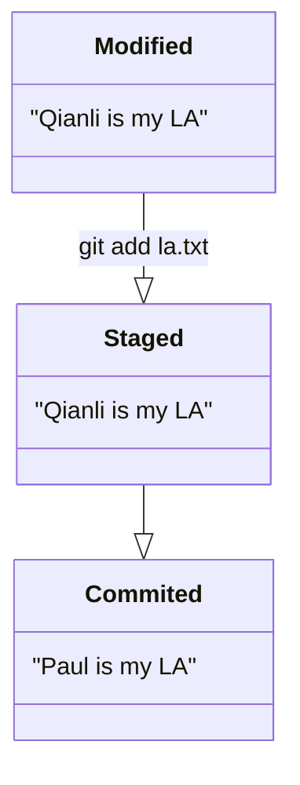
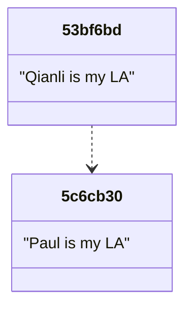
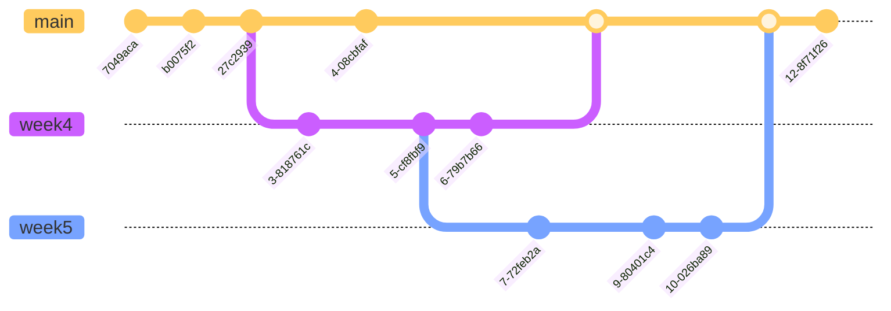
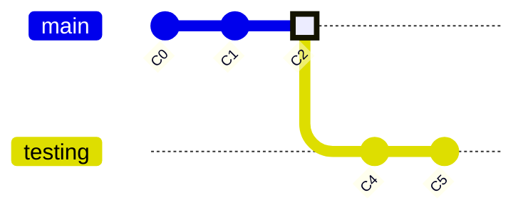
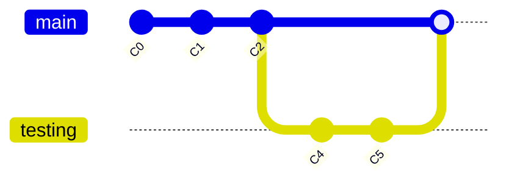
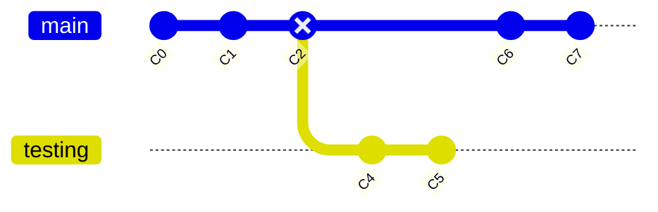
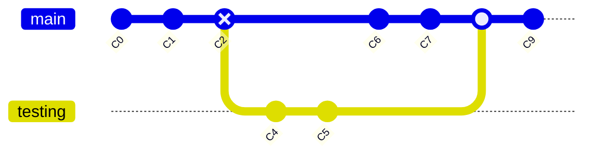

# Fall 2022

# CS 35L

# Discussion 1E

# Week 5


## Git

> Reference: [Pro Git 2nd Edition](https://git-scm.com/book/en/v2) 
>
> Assignment4: Chapter 1, 2.1-2.6, 3.1-3.5
>
> Assignment6: Chapter 3.6, 10
>
> 


* Berfore we start, please make sure you have installed Git

* If you haven't done so, it's OK

* Follow the instructions here:

  > https://git-scm.com/book/en/v2/Getting-Started-Installing-Git


##### Customize your Git Environment

> Reference: https://git-scm.com/book/en/v2/Getting-Started-First-Time-Git-Setup

* `git config`: set configuration variables

  ```mermaid
  flowchart LR
  		1(config) -->|override| 2("~./gitconfig")
  		2 -->|override| 3("[path]/etc/gitconfig")	
  ```

  

  * `[path]/etc/gitconfig` file: Contains values applied to every user on the system

    * only <span style="color:red">superuser</span> can make changes to it
    * use `git config` with option `--system` to change this file
  
    
  
  * `~/.gitconfig` file: values specific personally to you, the user
  
    * configuration for <span style="color:red">all</span> repositories of the user
    * use option `global` to write to this file

    

  * `.git/config` file in the Git directory
  
    * Specific configuration for <span style="color:red">one</span> repository
    * use option `local` to write to this file
  


* First thing you should do: identidy yourself:

  ```bash
    $ git config --global user.name "Qianli Wu"
    $ git config --global user.email qianliwu@g.ucla.edu
  ```


* GitHub uses the **email address** to link the commit to a GitHub user


> Worksheet Problem

1. [Make a private GitHub repository](https://github.com/new) titled “cs35l-assignments”.
2. Clone your newly created repository to your own computer.
3. Create an “assignment3/” directory. 
4. Put your related assignment 3 work in this directory. 
5. Commit it and push it to GitHub.
6. Clone your “cs35l-assignments” directory on SEASnet.
7. <span style="color:red"> [Optional] </span> How do you create a local repository and add it to Github?


## Viewing Your Staged and Unstaged Changes

* `git status` <span style="color:red"> * extremely useful</span>

* To see what you’ve changed but not yet staged: `git diff`


* To see what you’ve staged so far: `git diff --staged` or `git diff --cached`

  

  ##### Example

  * For a file `la.txt` includes a sentence:

  ```mermaid
  classDiagram
      class Commited
      Commited : "Paul is my LA"
  ```

  * What if we modified `la.txt` a little bit?

  ```bash
  $ echo "Qianli is my LA" > la.txt
  ```

  

  ```mermaid
  classDiagram
  		Modified --|> Staged 
  		Staged --|> Commited 
      class Commited
      Commited : "Paul is my LA"
      class Staged
      Staged : "Paul is my LA"
      class Modified
      Modified : "Qianli is my LA"
  ```


```bash
$ git diff
diff --git a/la.txt b/la.txt
index 049792a..b292754 100644
--- a/la.txt
+++ b/la.txt
@@ -1 +1 @@
-Paul is my LA
+Qianli is my LA

# Extra Question: What will git status show?
$ git status
```

* Then we add modified `la.txt` to staging area (or index area)

```bash
$ git add la.txt
```



* Which one will work?

```bash
$ git diff
$ git diff --staged
$ git diff --cached
```


* How about `git diff --staged`?


```bash
$ git diff --staged
diff --git a/la.txt b/la.txt
index 049792a..b292754 100644
--- a/la.txt
+++ b/la.txt
@@ -1 +1 @@
-Paul is my LA
+Qianli is my LA
```


* Then we make a commit

```bash
$ git commit -m "Changed LA name"
[main 53bf6bd] change LA name
 1 file changed, 1 insertion(+), 1 deletion(-)
```




* How can we tell the difference between commit `5c6cb30` and `53bf6bd`?


* Which one wil work?

```bash
$ git diff
$ git diff --cached
$ git diff --staged
$ git diff 5c6cb30..53bf6bd
$ git diff 5c6c..53bf
$ git diff 5c6..53b

# How about these?
# HEAD is a pointer points to a commit, usually the most recent commit on your branch
$ git diff HEAD
$ git diff HEAD^..HEAD
$ git diff HEAD~1..HEAD
$ git diff HEAD^!
$ git log -1 -p  # p stand for patch
$ git show
```


## Viewing the Commit History

* `git log`

  ```bash
  $ git log -p
  $ git log --stat
  $ git log --oneline
  $ git log --pretty=format:"%h - %an, %ar : %s"
  $ git log --oneline --decorate --graph --all
  
  
  # Look for differences that change the number of occurrences of the specified string (i.e. addition/deletion) in a file.
  $ git log -S<string>
  ```


* Remember the Example above?

```bash
$ git log
commit 53bf6bd870ccb907448c76d6ab101d3dbbab0691 (HEAD -> main)
Author: Qianli Wu <qianliwu@ucla.edu>
Date:   Fri Oct 28 13:13:17 2022 -0700

    change LA name

commit 5c6cb30ac7e1019c7b8e3753e405f3f87279c30d
Author: Qianli Wu <qianliwu@ucla.edu>
Date:   Fri Oct 28 13:02:13 2022 -0700

    initialize la.txt
```


* Next Question: What is `main` in `(HEAD -> main)` after the commit hash?


## Git Branching




* Branching means you diverge from the main line of development and continue to do work without messing with that main line.

* Git branches is lightweight

  * branching operations can be done instantaneously

  * why?

  * <details>     
      <summary>Answer</summary>     
      <p style="color: red"> pointers
     </p>
    </details>


* By default Git will create a branch called *master* when you create a new repository

  ```bash
  $ git config --global init.defaultBranch main
  ```

  * Set `main` as the default branch name


##### Create a branch

* `git branch testing`


* How does Git know what branch you’re currently on?

  <details>     
    <summary>Answer</summary>     
    <p style="color: red"> another pointer called HEAD
   </p>
  </details>


##### Switching Branches

* `git checkout`

  ```bash
  $ git checkout testing
  ```


* If we do another commit:

```bash
$ touch test.txt
$ git commit -a -m 'made a change in testing branch'
```


##### Create a branch and Switch to it

* `git checkout -b ${branch_name}`


## Merging

* Suppose the `testing branch` is tested, and we want to add the new functionalities into `main branch`
* `git merge`


##### 1. Fast-forward



* After we merged:



* Git just moves the branch pointer forward


##### 2. Three-way merge

* What if we (or others) make a few commits (C6, C7) on `main branch`?




* Git will compare `C5` and `C7` with their common acester `C2`




* <span style="color:red"> [Optional, Hard] </span> Can there be more than one common ancesters between two commits?

