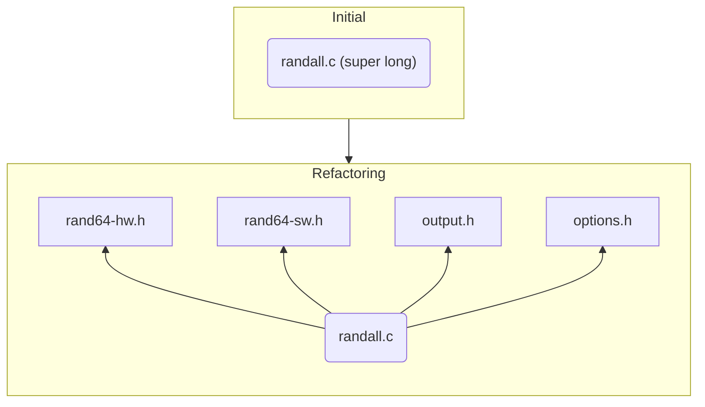
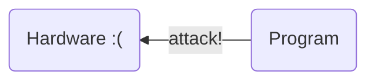
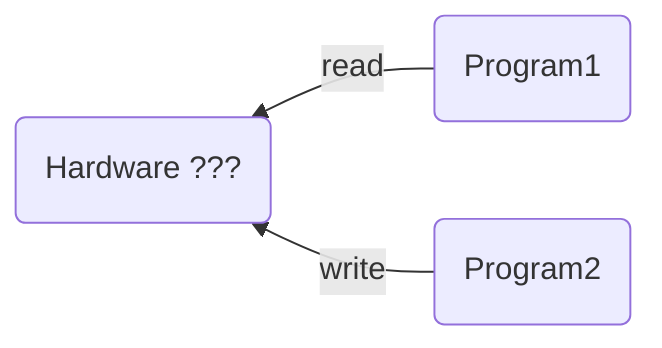
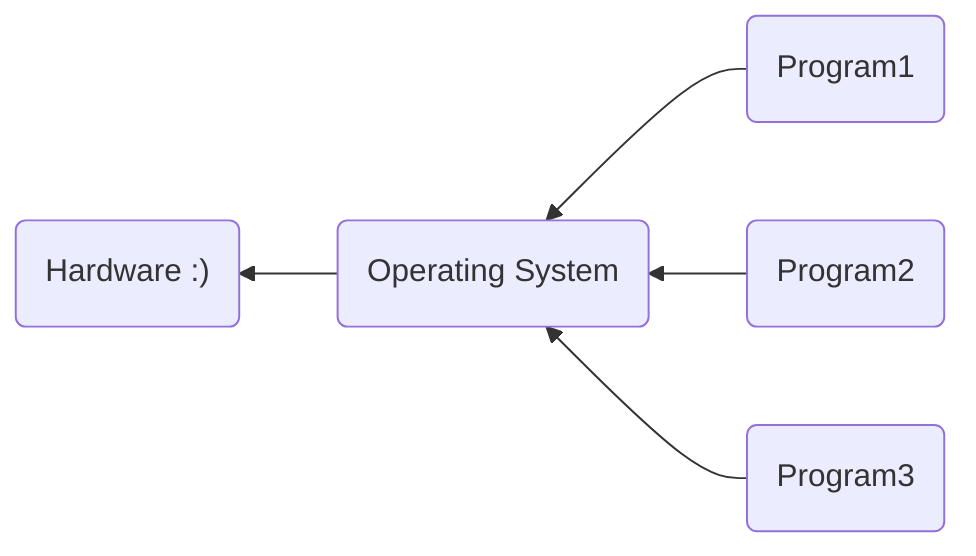

# Fall 2022

# CS 35L

# Discussion 1E

# Week 6


## Announcement

##### Exercise:

Ethan has made [Assignment 5: Low Level Refactoring exercise](https://github.com/ethansaurusrex/CS35L-Low-Level-Refactoring-Tutorial)

##### Workshop for Assignment 5:

TBD, next week (week 7)

##### Join us! Winter LA application is open!

[https://tinyurl.com/AppLAW23](https://tinyurl.com/AppLAW23)


* QR code for this markdown file:


## Refactoring



* Why?

  * easier to understand
  * help debug ---> make life easier?
  * save compile time?

  

* How to compile our program?

```shell
$ gcc -O0 -Wall -Wextra ... rand64-hw.c -o rand64-hw.o -c
$ gcc rand64-sw.c -o rand64-sw.o -c
$ gcc output.c -o output.o -c
$ gcc options.c -o options.o -c
$ gcc ... randall.o rand64-hw.o rand64-sw.o output.o options.o -o randall
```

* Do you want to run these commands every time after a minor change in your program?

<details>     
  <summary> Answer</summary>     
  <p style="color: red">No!</p>
</details>

<details>     
  <summary>Then?</summary>     
  <p style="color: red">Makefile!</p>
</details>


## Makefile

* a build tool designed for developers
* a layer above shell
* Handle incremental build weel and enable parallelization

```{makefile}
foo: foo1.o foo2.o foo3.o   # behind the comma are dependencies
		g++ foo1.o foo2.o foo3.o -o foo
foo1.o: foo.c
		g++ -c foo.c
```


##### Macros

```makefile
XYZ = foo1.o foo2.o foo3.o
foo: XYZ 
		g++ XYZ -o foo
```


##### Leading `-` before a command

```{makefile}
distclean: distclean-recursive
	-rm -f $(am_CONFIG_DISTCLEAN_FILES)  
	-rm -f Makefile
```

* makefile usually *stop* when a command fails, opposite to shell script
* Keep going even if that command fails
* Ignore exit status of failed commands


## Kahoot!

```makefile
targets: prerequisites
	command
	command
	command
```


```makefile
CC = gcc
CFLAGS = -O2 -g3 -Wall -Wextra

another:
		echo "Hello There"

ratatouille: 
		echo "Implement me!"
```


```makefile
CC = gcc
CFLAGS = -O2 -g3 -Wall -Wextra

default: ratatouille

another:
		echo "Hello There"

ratatouille: another
		echo "Implement me!"
```


## System call

A way for programs to interact with the operating system.






* Please protect our computers!



* So OS provides some system calls for those "risky" operations
* Interested? Take `CS 111` next quarter!


##### Categories of system calls

> Reference: https://en.wikipedia.org/wiki/System_call#Categories_of_system_calls

1. Process control

   * `fork`

2. File management

   - `open` or `close` a file

   - `read` and `write`

3. Device management

4. Information maintenance

5. Communication

6. Protection


##### Write() system call

```C
#include<unistd.h>
ssize_t write(int fd, const void *buf, size_t count);
```

* `fd` stands for a file descriptor
  * in this case probably only `standard output` or standard error?
* `*buf ` stands for buffer. This contains any data in it.
* `count` is the number of bytes to be written to a file descriptor from the buffer


