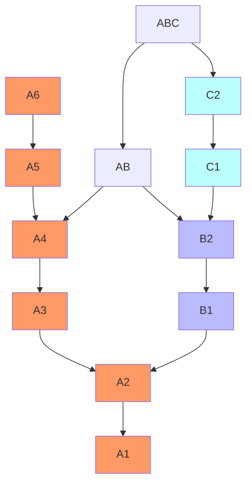
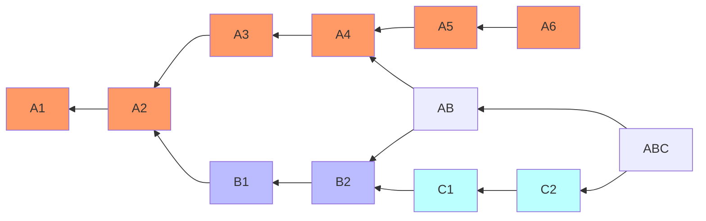

# Fall 2022

# CS 35L

# Discussion 1E

# Week 8


## Anouncement

* Workshop for Assignment 6
  * probably on Monday?

## Resources:

Reference: [Pro Git 2nd Edition](https://git-scm.com/book/en/v2) 

Assignment6: Chapter 10.1 - 10.4


[Tutorial made by Sashwath on YouTube](https://www.youtube.com/watch?v=r1wGH5b3V2E)


## Directed Acyclic Graph (DAG)



* Directed
* Acyclic (No Cycle)

##### Git Graph




## Topological Sort

* Topological Sort  <---->  DAG

```
L ← Empty list that will contain the sorted elements
S ← Set of all nodes with no incoming edge

while S is not empty do
    remove a node n from S
    add n to L
    for each node m with an edge e from n to m do
        remove edge e from the graph
        if m has no other incoming edges then
            insert m into S

if graph has edges then
    return error   (graph has at least one cycle)
else 
    return L   (a topologically sorted order)
```

* for every directed edge *uv* from vertex *u* to vertex *v*, *u* comes **before** *v* in the ordering


## Final Review

###### 1a) If you use Github to store your class project souce code, what is your failure model for backups, and what are the most important failures to worry about?

* `git rm -rf`
* `git merge --abort`
* Attacker

<details>     
  <summary>Possible Answer</summary>     
  <p style="color: red"> delete data, trash data, messed up when using `git rebase`</p>
</details>


###### 1b) What backup strategy should work well for these failures?
