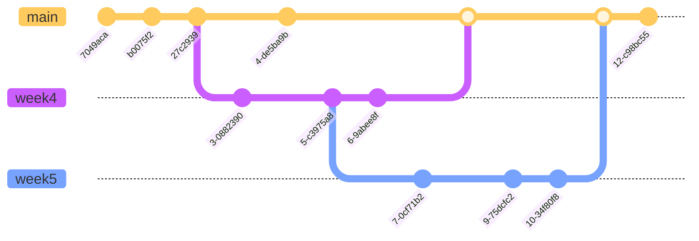

# Git

##### start

```shell
$ git clone # clones existing repository + creates working file & empty index
$ git init # creates a new repo
$ git reset --hard HEAD # reset working tree as HEAD (works when only .git directory exists)
```

### Viewing the Commit History

##### show difference

```shell
$ git diff # working files - (repository + index)
$ git diff --staged (or --cached)  # compare index files with last committed files
$ git diff foo.c bar.h  # only show differences for these files
$ git diff A..B  # assuming A & B are commmit IDs
# if there's a collision in commit name and file name:
$ git diff A -- F  # look at the commit A and focus on difference in file F
```

##### show history

```shell
$ git log  # output the entire history of the project
$ git log A..B  # limits and logs between commit A and commit B
$ git log -p
$ git log --stat
$ git log --oneline
$ git log --pretty=format:"%h - %an, %ar : %s"
$ git log --oneline --decorate --graph --all
$ git log -S<string> # Look for differences that change the number of occurrences of the specified string (i.e. addition/deletion) in a file.

$ git reflog # full history no matter witch branch you are (records when the tips of branches and other references were updated in the local repository)
```

```shell
$ git show HEAD   # git log + git diff
$ git show A..B 
```

- **Commit expressions**
  - `A^`   A's parent
  - `A^^^^^ `, `HEAD~3`
  - `HEAD`   most recent commit
  - `name `   named commit
  - `A^!`    $\equiv$  `A^..A ` the difference between A's parent and A

```shell
$ git status # reminds you of what you're up to
```

```shell
$ git grep PATTERN  # =  grep PATTERN $(git ls-files)
```

##### Configuration

```shell
$ git config -l # list configuration from .git/config (in current directory) and ~/.gitconfig (global) and other files
$ git config --global user.name "Qianli Wu"
$ git config --global user.email qianliwu@g.ucla.edu 
```

##### Trace Contribution

```shell
$ git blame FILE  # see who contributed what in a FILE
$ git blame A -- FILE
```

```shell
$ git bisect # figure out who introduced the bug, narrowing the problem down
# specify a test case (any shell command), run it between good commit and bad commit in Binary Search O(logN)
$ git bisect HEAD # HEAD is bad
$ git bisect v27 # v27 is good
$ git bisect run make check  # "make check" can be any shell command
# problem1: GGBGGBBBGGBB  # bad versions happen mixed with good versions
# problem2: different branches, one good and one bad
```


### Git Branching

- a lightweight *movable* pointer to a commit (move the pointer for every new commit)
- Branching means you diverge from the main line of development and continue to do work without messing with that main line.
- More detailed explaination in notes for `week 5_git.md`



##### Branch operations

```shell
$ git fetch  # copy remote repository into ours (into a separate area)
# git fetch only update remote branch (e.g. origin/main)
$ git merge origin/master  

$ git checkout main # checkout to main branch
$ git merge <branch name> # look at common ancester A, then do a 3-way diff
$ git merge <parent1> <parent2> <parent3> ...  # can merge with multiple parents

$ git pull   # git fetch + git merge
# some philosophy: you should never pull to avoid merges; it depends on how you worried about merge (languages like C/C++ not good for merge)
```

```shell
$ diff3 -m O A N # Other(O), Common-Ancester(A), New-Version(N)
# !!! Can't assume other parts without conflicts are good
```

##### Tag

- also a lightweight pointer to a commit

- branches are movable tags

- Used for *important* commits

- `git tag [-a] <tag> [-m <tag message>] [<commit id>]`

- ```sh
  $ git tag -a v13 -m "Our best release!" <COMMMIT ID> # annotated tag, heavier weight tag (message)
  $ git tag v13 <COMMIT ID> # 
  $ git tag # list all tags
  $ git tag -l PATTERN  # show tags contains pattern
  $ git push origin v13  # push the tag v13 to public repository
  $ git tag -s -a v13 -m "Greatest version"  # sign this tag with my GPG key (public/private key)
  ```

-  Signing tags helps very much for distributing your software securely to your users.

- For developers, they can verify nothing malicious got introduced in a git commit

##### Commit

- Avoid changing history, especially in public repository: other developers may rely on it. 

```shell
$ git fetch # make sure the copy of upstream is up-to-date
$ git rebase origin/main  # like a merge
```

- cons: lying about history, **never do it in published repository**
- pros: has a much simpler history, a long straight line
- better for small staff (rebase than merge)

###### How to "edit" an older commit? Dangerous!!!

```{shell}
$ git rebase -i (other branch) # -i = interactive;
edit 68e342 ... # make some changes to previous commit 68e342, then git add, then git rebase --continue
reword 68e342  # change the commit message for commit 68e342
```

* Only Edit History in Repo that is not shared

* Aside: **Change History**

  ```shell
  $ git commit --amend    # Change most recent Git commit message
  ```


##### Stashing

* Work in progress

  ```shell
  $ git stash <save "save message"> # save the working image, with some message
  $ git stash list # check existed stashes
  $ git stash pop # reapply previously stashed changes, remove stashed changes
  $ git stash apply <ID> # reapply but keep stashed files
  $ git stash show # view a summary of a stash 
  $ git stash clear # delete all stash
  $ git stash drop stash@{1} # drop the second stash
  ```

* Alternetive (control the history)

  ```shell
  $ git diff > my.diff  # store difference in a file my.diff
  $ git checkout main  # switch working in main branch
  [edit....commit]
  $ git checkout p  # check back to older version
  $ patch -p1 < my.diff  # restore the progress
  ```

  ```sh
  $ diff A B >B-A.diff
  $ patch <A-B.diff. # edit A to make it look like B, A = A + (A-B.diff) == B
  ```


# Git Internals

* **plumbing** - low level stuff implementors care about  `e.g. git cat-file <file hash id>`
* **porcelain** - beauty treatment: *user-friendly* interface.  `e.g. git rebase`


### `./git` subdirectories:

1. `branches/` useless now
2. `config` configuration
3. `HEAD` head branch, which branch the current HEAD at? directory to another file
4. `hooks`/ specifies well-know
   - where creating your own porcelain (self-defined user-friendly commands)
5. `index` represent the next change
6. `info/exclude` things you don't want to pay attention to, like `.gitignore` but not in repository
7. `logs/` records when branch trips were updated
8. `objects/` files added to git repository
   - at first it stores all files compressed by zlib with name 40 bit hash
   - However, size too big for object and too many files under single directory
   - Thus, store first 2 digits as folder name, thus divides the number of files by 256
   - `git clone` will create a read-only hard links to those history files in repository, thus very cheap
9. `pack-ref` what all the names of commits, (tags)
10. `refs` not optimized version of `pack-ref`

* **Like POSIX file system, multiple pointers to a file (hardlink)**
  * like a virtual file system implemented above traditional file system, like VPN in network
  * `git hash-object` provides a bunch of bytes and it returns SHA-1 checksum of it
    * SHA-1 designed to be **reliable**, secure
    * it's really expensive to have different string to hash same SHA-1 value
    * attacker will have great trouble pretending other message was sent instead of the original
    
    


### Git Internal Structure

* `git cat-file` , `HEAD^{tree}`
* `git unpdate-index`  add a file to index
* `git write-tree` write a tree for what's in index
* `git commit-tree TREEID -p PARENT_COMMITID` commit a tree, they type commit message
* SHA_1 prevents cycling in git internal (commit graphs are DAG)
* Git cannot compress **jpeg** like file very well, but we can store them somewhere else and sore pointers to them


##### Bolb

* an git object (e.g. a file)

##### Tree 

* directory, maps names to other objects (other trees and bolbs)

  * (mode) octal number: file type (100: regularfile, 040: directory) + default permissions (644 rw for users an r for others)

  * type 

  * commit id

  * Name

##### Commit 

*  labeled object, containing **commit** **message** + **times** + **tree** **object** + ...


# Compression

* Objects are represented in compressed form

* Ways compression is done  **zlib $$ \approx $$ gzip**

* compression quality (the ratio between compressed and original file)

* performance (CPU time)

* zlib/gzip compression ideas:


### Huffman coding

* proved to be optimal for its problem


* Assume input is a sequence of symbols from a finit set (bytes 0-255)
* output is a bit string, each bit represents some bytes in input
  * common symbols with shortest bit
  * rarely used symbols with longer bits

##### Problem

* more prone to data crush: if a bit in output is incorrect, then if may affect many others behind it. 

* Can't figure out what's the last character since it can only read from front to end to decode

  

##### classic haffman coding

* compressor + decompressor know tree structure in advance
* zlib computes the tree on the fly
  * after each input symbol, the compressor updates its tree
  * the decompressor knows this
  
  

### Dictionary coding

* requires more memory, can use a lot of RAM
  * Sliding window approach
    * remove older words if the dictionary size is too much
* dictionaries won't be saved
  * decopression is relatively cheap O(N)
  * compression is expensive O($$N^2$$)
* fixed
  * the compressor and decopressor shares a dictionary of common words
  * assign each words an index, can add whitespace behind a word to reduce compressed size
  * Only works for specific, pre-defined language, e.g., English
* **adaptive dictionary compression**
  * when decoder encourters letter triplets or entire words that are not yet in the dictionary, then it adds them

* Zlib: **adaptive dictionary compression + huffman coding**

